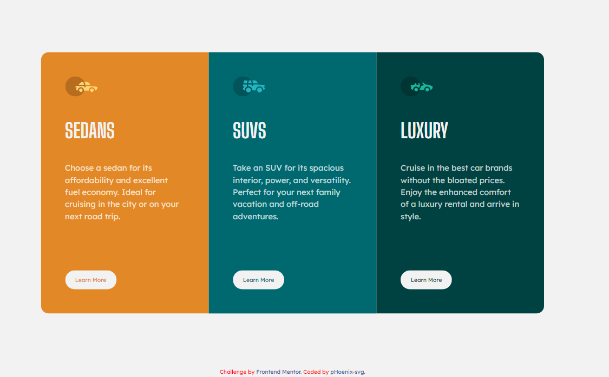

# Frontend Mentor - 3-column preview card component solution

This is a solution to the [3-column preview card component challenge on Frontend Mentor](https://www.frontendmentor.io/challenges/3column-preview-card-component-pH92eAR2-). Frontend Mentor challenges help you improve your coding skills by building realistic projects.

## Table of contents

- [Frontend Mentor - 3-column preview card component solution](#frontend-mentor---3-column-preview-card-component-solution)
  - [Table of contents](#table-of-contents)
  - [Overview](#overview)
    - [The challenge](#the-challenge)
    - [Screenshot](#screenshot)
    - [Links](#links)
  - [My process](#my-process)
    - [Built with](#built-with)
    - [What I learned](#what-i-learned)
    - [Continued development](#continued-development)
  - [Author](#author)

## Overview

### The challenge

Users should be able to:

- View the optimal layout depending on their device's screen size
- See hover states for interactive elements

### Screenshot

### Links

- Solution URL: [Github](https://github.com/pHoeniX-svg/3_column_card)
- Live Site URL: [Github Pages](https://phoenix-svg.github.io/3_column_card/)

## My process

### Built with

- Semantic HTML5 markup
- CSS custom properties
- Flexbox
- CSS Grid
- CSS Transforms and Transition
- Mobile-first workflow

### What I learned

I learned styling ` ` links as buttons, transforms, transitions, and a bit of markdown

### Continued development

- Styling ` <button></button>` elements
- Working with transforms, transitions and animations
- Mastering CSS Grid and Flexbox

## Author

- Website - [pHoenix-svg](https://www.your-site.com) - Website in Development
- Frontend Mentor - [@pHoeniX-svg](https://www.frontendmentor.io/profile/pHoeniX-svg)
- Twitter - [@princemuel_cs](https://twitter.com/princemuel_cs)
